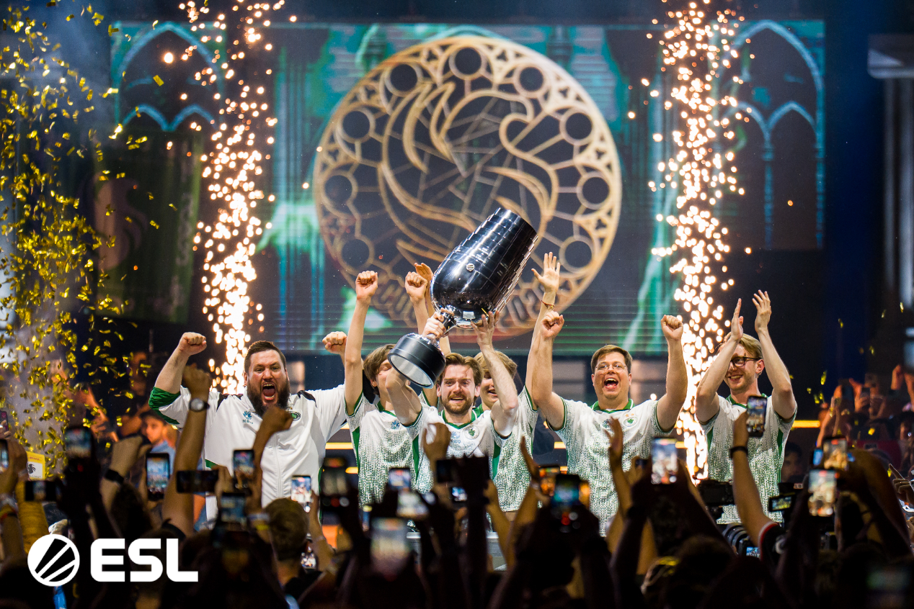
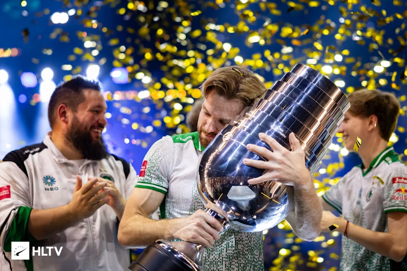
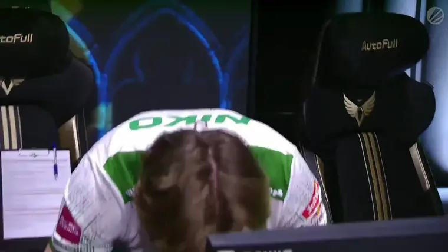
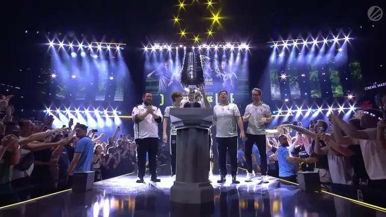
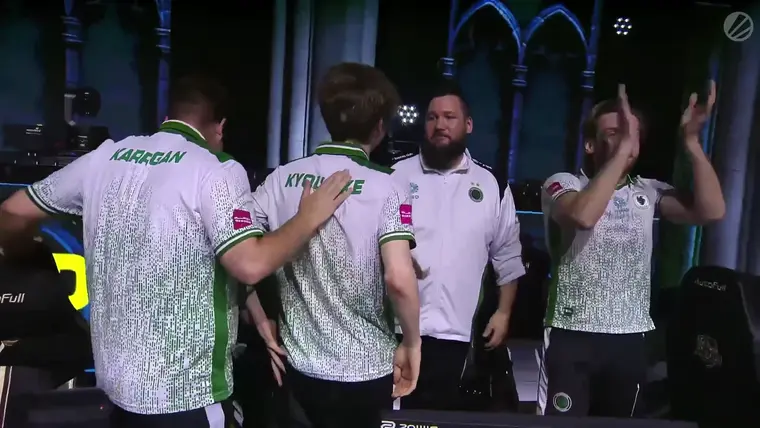

  

   
    

  

    
    
  

  

  

---

# I love you, NiKo!
波士顿的梦魇，斯德哥尔摩的遗憾，18次深夜中的眼泪，化成对冠军近乎癫狂的执念。十一年如一日的坚守，终破烙印胸膛中的心魔。
尼古拉·科维奇，不以天赋自矜的天才，终将成就不朽的传奇。
见证历史！恭喜NiKo夺得2026科隆major冠军！

The nightmare of Boston, the regret of Stockholm, eighteen late-night tears—all condensed into an almost obsessive pursuit of the championship. Eleven years of unwavering persistence, finally breaking the inner demon branded upon the chest.
Nikola Kovač, a genius who never relied on his talent as pride, will ultimately forge an immortal legend.
Witness history! Congratulations to NiKo on winning the 2026 Cologne Major Championship!

<table align="center" width="100%" cellpadding="0" cellspacing="0" border="0">
  <tr>
    <td width="50%" valign="top">
      
    </td>
    <td width="50%" valign="top">
      
    </td>
  </tr>
</table>
<table align="center" width="100%" cellpadding="0" cellspacing="0" border="0">
  <tr>
    <td width="33.3%" valign="top">
      
    </td>
    <td width="33.3%" valign="top">
      
    </td>
    <td width="33.3%" valign="top">
      
    </td>
  </tr>
</table>