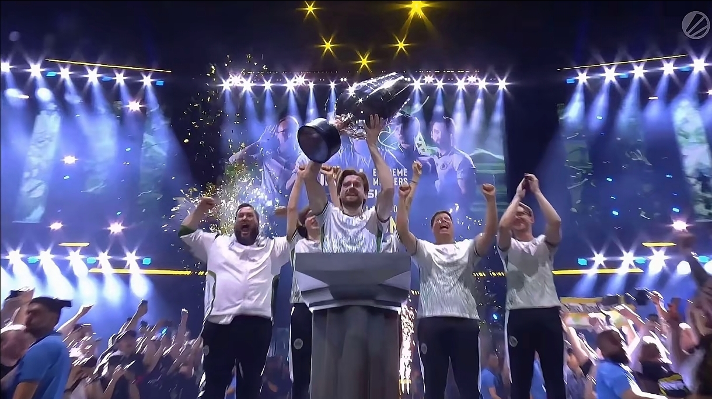
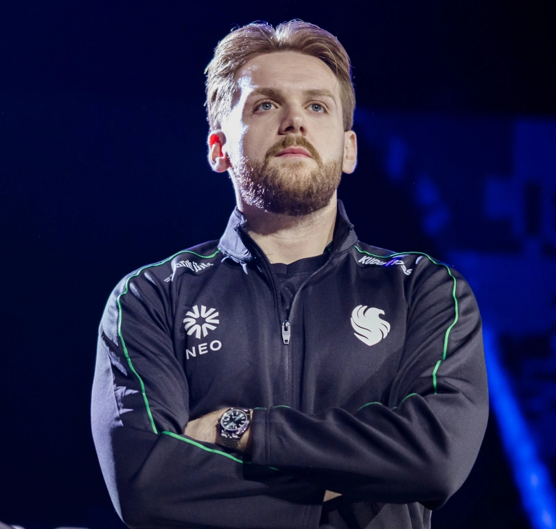

  

   
   

  

   
   

  

---

# I love you, NiKo!
波士顿的梦魇，斯德哥尔摩的遗憾，18次深夜中的眼泪，化成对冠军近乎癫狂的执念。十一年如一日的坚守，终破烙印胸膛中的心魔。
尼古拉·科维奇，不以天赋自矜的天才，终将成就不朽的传奇。
见证历史！恭喜NiKo夺得2026科隆major冠军！

<table align="center" width="100%" cellpadding="0" cellspacing="0" border="0">
  <tr>
    <td width="33.3%" valign="top">
      

        
        

          <a href="https://v.douyin.com/6sX_PGdaX3w/">我要开始跳法尔孔战舞了</a>
        

      

    </td>
    <td width="33.3%" valign="top">
      
    </td>
    <td width="33.3%" valign="top">
      
    </td>
  </tr>
</table>

# 头像源于[pixiv](https://www.pixiv.net/artworks/143203968)